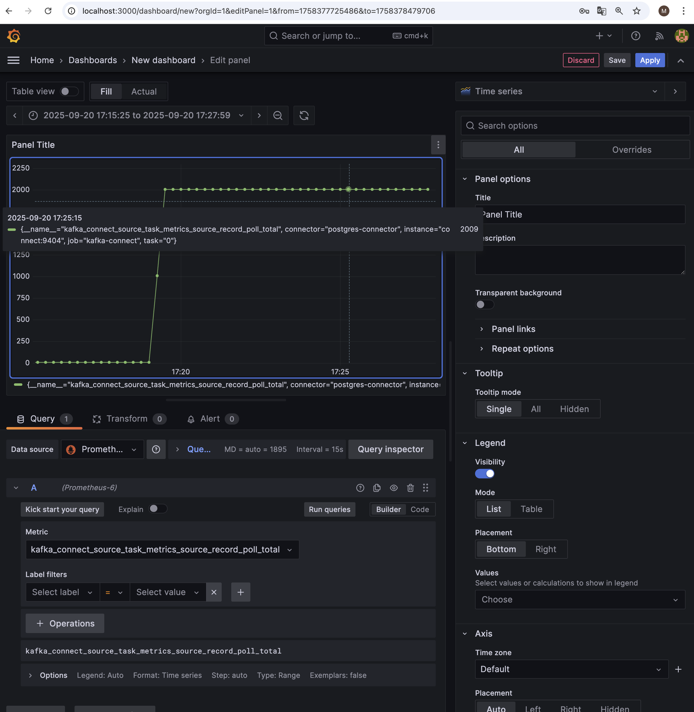

# Debezium CDC для PostgreSQL и Apache Kafka

## Описание проекта
В этом проекте используется Debezium Connector для PostgreSQL с целью передачи изменений данных (CDC) в Apache Kafka.
Проект включает мониторинг метрик Kafka Connect через Prometheus и визуализацию в Grafana.

**Цели:**
- Настроить Debezium Connector для таблиц `users` и `orders`.
- Передавать изменения данных в Kafka.
- Собрать и визуализировать метрики работы коннектора.
---

## Компоненты проекта

| Сервис | Описание |
|--------|----------|
| **Zookeeper** | Управление кластером Kafka |
| **Kafka Broker** | Хранение и обработка сообщений |
| **PostgreSQL** | База данных с таблицами `users` и `orders` |
| **Kafka Connect** | Интеграция Debezium с PostgreSQL и Kafka |
| **Debezium Connector** | Отслеживание изменений таблиц PostgreSQL |
| **Prometheus** | Сбор метрик Kafka Connect |
| **Grafana** | Визуализация метрик |

# Запуск проекта
1. Запустить Docker Compose:
   docker compose up -d
2. Проверить, что все сервисы запустились:
   docker compose ps

# Проверка работы Debezium
1. Регистрация коннектора
   curl -i -X POST \
   -H "Accept:application/json" \
   -H "Content-Type:application/json" \
   http://localhost:8083/connectors/ \
   -d @debezium/connectors/postgres-connector.json

2. Если необходимо удалить и создать новый коннектор
   curl -i -X DELETE http://localhost:8083/connectors/postgres-connector

   curl -s http://localhost:8083/connectors | jq .

   curl -i -X POST \
   -H "Accept:application/json" \
   -H "Content-Type:application/json" \
   http://localhost:8083/connectors/ \
   -d @debezium/connectors/postgres-connector.json

3. Список всех коннекторов
   curl -s http://localhost:8083/connectors | jq .

4. Убедиться, что Debezium коннектор работает и в статусе RUNNING:
   curl -s http://localhost:8083/connectors/postgres-connector/status | jq .

5. Проверить существующие топики
   docker exec -it kafka-practice-3-kafka-1 kafka-topics --bootstrap-server kafka:9092 --list

    В кластере Kafka после запуска доступны следующие топики:
| Топик               | Назначение |
|----------------------|------------|
| `__consumer_offsets` | Служебный топик Kafka для хранения оффсетов (позиции чтения) у consumer-групп. |
| `my_connect_configs` | Служебный топик Kafka Connect для хранения конфигурации коннекторов. |
| `my_connect_offsets` | Служебный топик Kafka Connect для хранения оффсетов коннекторов (с какой позиции читать источник). |
| `my_connect_status`  | Служебный топик Kafka Connect для хранения статусов коннекторов и тасков. |
| `shop.public.orders` | CDC (Change Data Capture) топик с изменениями таблицы `orders` в Postgres. |
| `shop.public.users`  | CDC топик с изменениями таблицы `users` в Postgres. |

6. Проверить детали топика
   docker exec -it kafka-practice-3-kafka-1 \
   kafka-topics --bootstrap-server kafka:9092 --describe --topic shop.public.users

   docker exec -it kafka-practice-3-kafka-1 \
   kafka-topics --bootstrap-server kafka:9092 --describe --topic shop.public.orders

# Проверка CDC (Change Data Capture)
1. Подключение к БД и вставка нового пользователя
    - подключение к БД
      docker exec -it kafka-practice-3-postgres-1 psql -U user -d shop
   
    - проверка таблиц
      \dt
   
    - посмотреть содержимое таблицы `users`
      SELECT * FROM users;

    - посмотреть содержимое таблицы `orders`
     SELECT * FROM orders;
   
    - делаем вставку пользователей и заказов (1000 пользователей и 1000 заказов)
      INSERT INTO users (name, email)
      SELECT
      'User ' || g AS name,
      'user' || g || '@example.com' AS email
      FROM generate_series(1, 1000) g;

      INSERT INTO orders (user_id, product_name, quantity)
      SELECT
      (random() * 1000 + 1)::int,
      'Product ' || (random() * 100 + 1)::int,
      (random() * 10 + 1)::int
      FROM generate_series(1, 1000);
   
2. Запустить консумер Kafka и посмотреть сообщения из топиков `shop.public.users` и `shop.public.orders`
   docker exec -it kafka-practice-3-kafka-1 kafka-console-consumer \
   --bootstrap-server kafka:9092 \
   --topic shop.public.users \
   --from-beginning

   docker exec -it kafka-practice-3-kafka-1 kafka-console-consumer \
   --bootstrap-server kafka:9092 \
   --topic shop.public.users \
   --from-beginning

# Доступ к Kafka-UI
http://localhost:8080

# Доступ к Prometheus
http://localhost:9090/query

# Доступ к Grafana
http://localhost:3000
Смотрим общее количество записей, полученных из источника 
Название метрики `kafka_connect_source_task_poll_records_total` 
